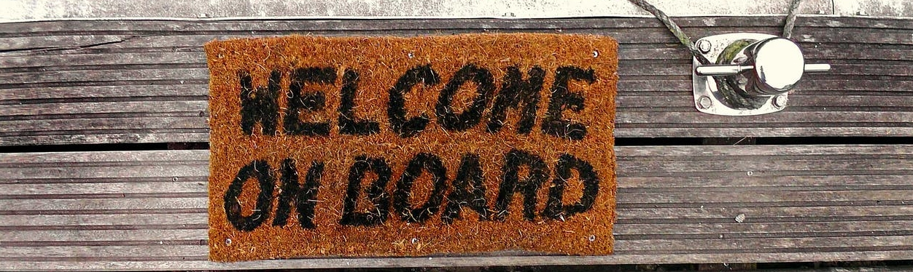

## Hi there 👋, I'm Tuna Alikaşifoğlu

### Graduate Student at Bilkent University, Electrical and Electronics Engineering Department

- 🔭 I'm currently pursuing M.S. degree at the department of Electrical and Electronics Engineering, Bilkent University. I received my BS degree from the same department. I'm interested in digital signal processing and image processing in the context of graph signal processing.

#### Languages with Private Repos

